# Document Analyzer

This repository contains source code and guide how to build document analyzer with Function App, Azure AI Document Intelligence, Logic App and Cosmos DB.

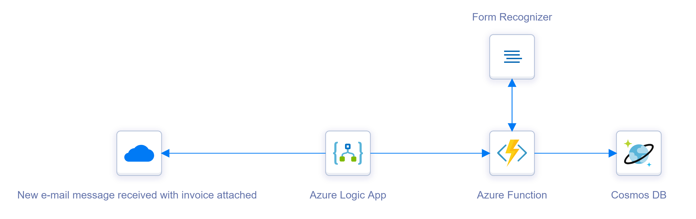

## Prepare resource group with Azure services

Below image presents azure services used in the solution:

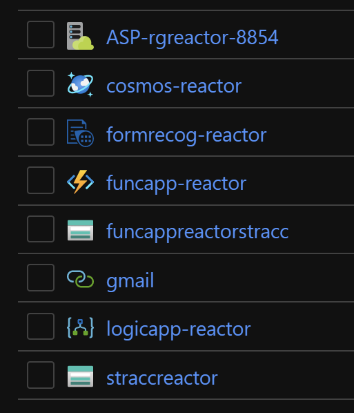

## Train Azure AI Document Intelligence model

Please use [this](https://docs.microsoft.com/en-us/azure/cognitive-services/form-recognizer/quickstarts/label-tool) instructions to setup labeling tool and train Azure AI Document Intelligence model.

Below steps show how Azure AI Document Intelligence model was trained:

1. Upload [test](https://github.com/SwarupYonX/Azure-Document-Intelligence/blob/main/src/document-analyzer/sample_data.zip) files to the Azure Blob Storage:

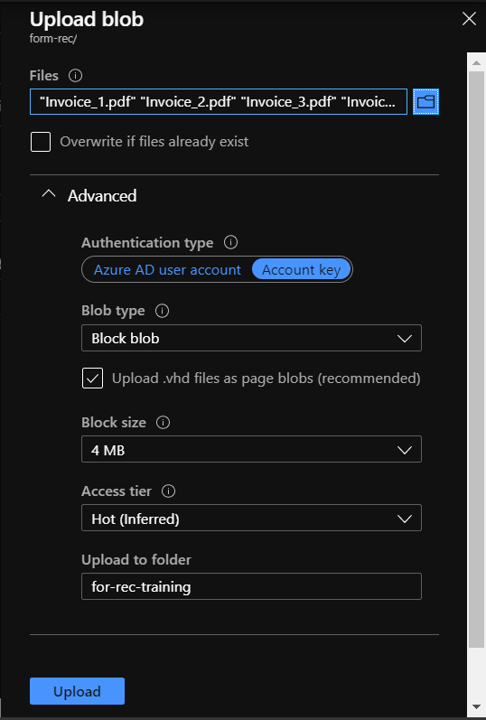

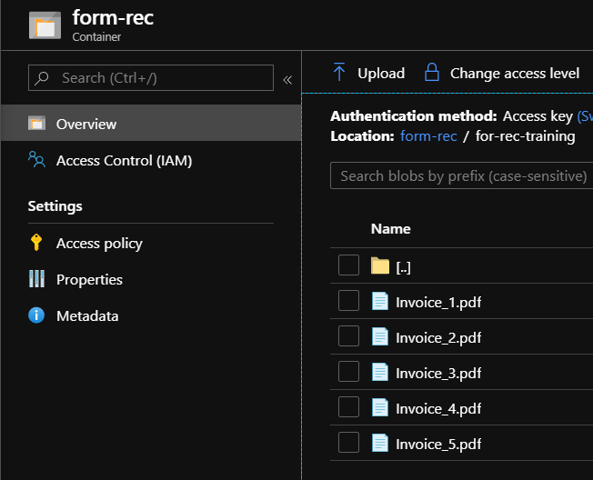

2. Setup Azure AI Document Intelligence model:

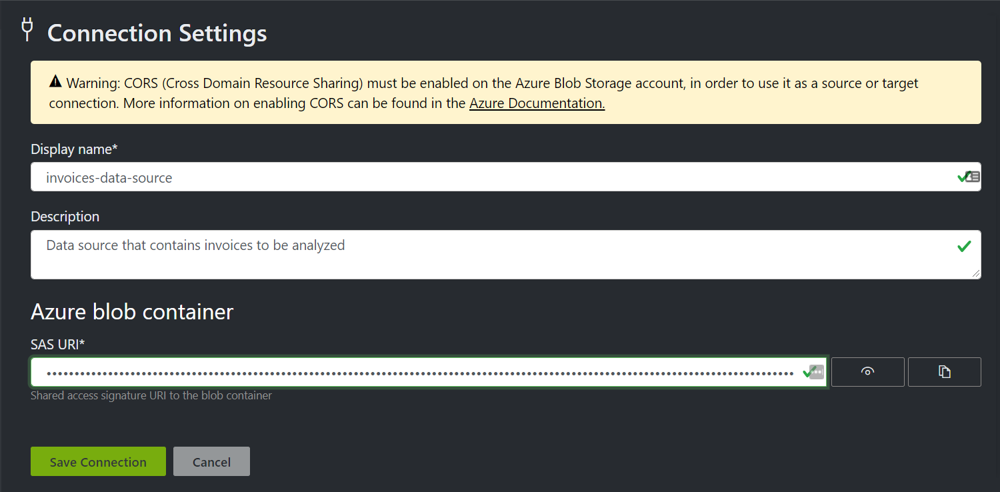

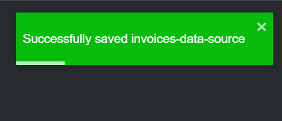

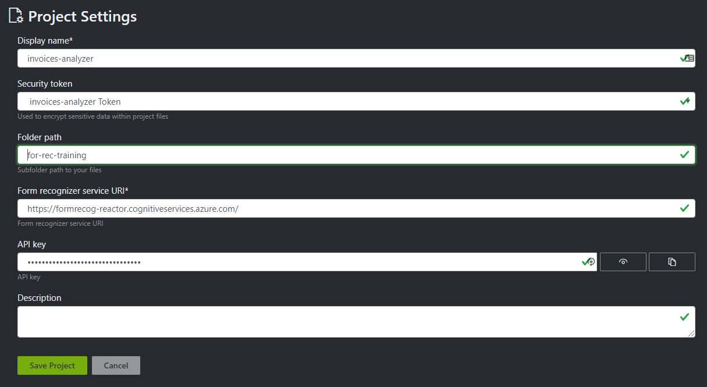

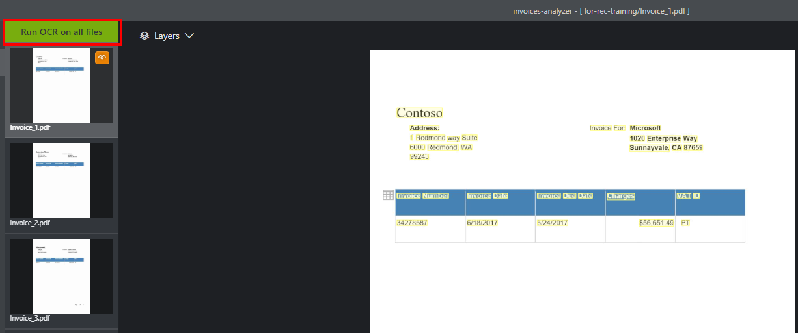

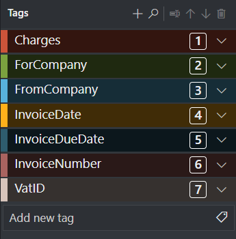

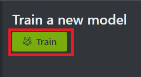

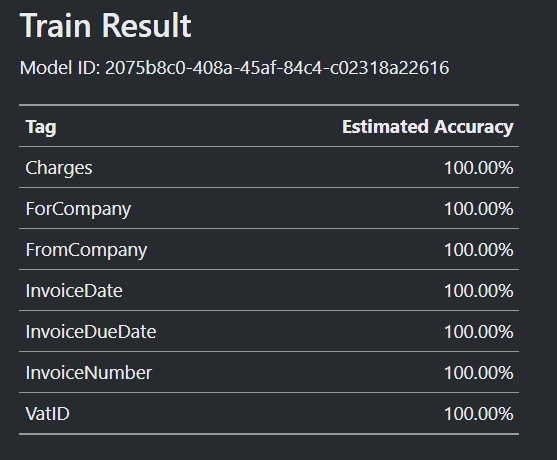

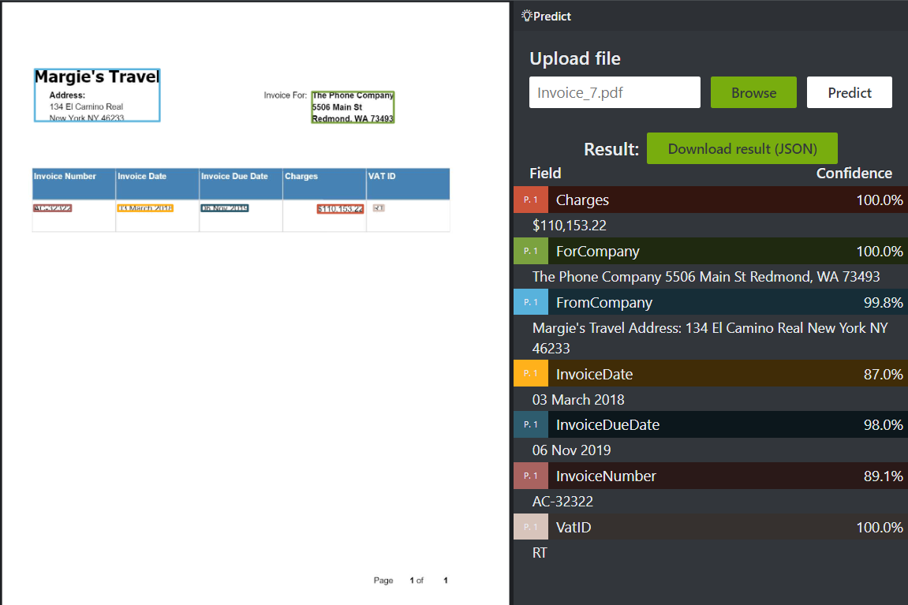

## Setup Azure Function App

Azure Function App source code for processing and inserting data to the Cosmos DB is available in [this](https://github.com/SwarupYonX/AzureAI/tree/master/src/document-analyzer/src) repository.

## Setup Azure Logic App

Below steps show how Azure Logic App is configured:

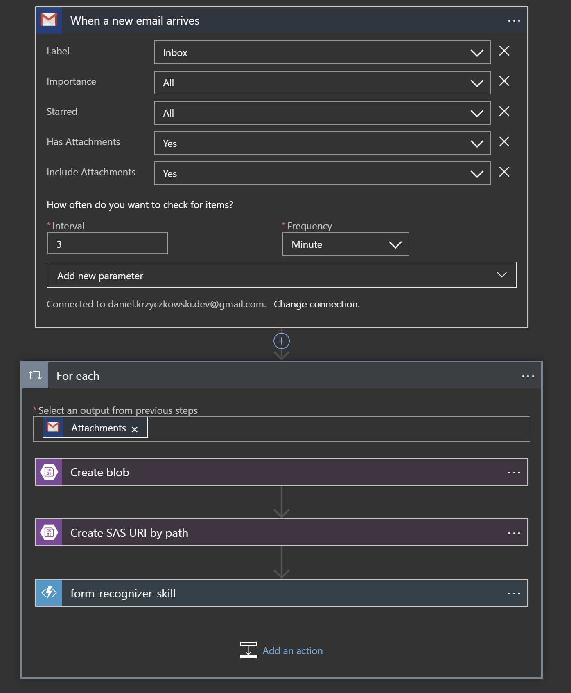

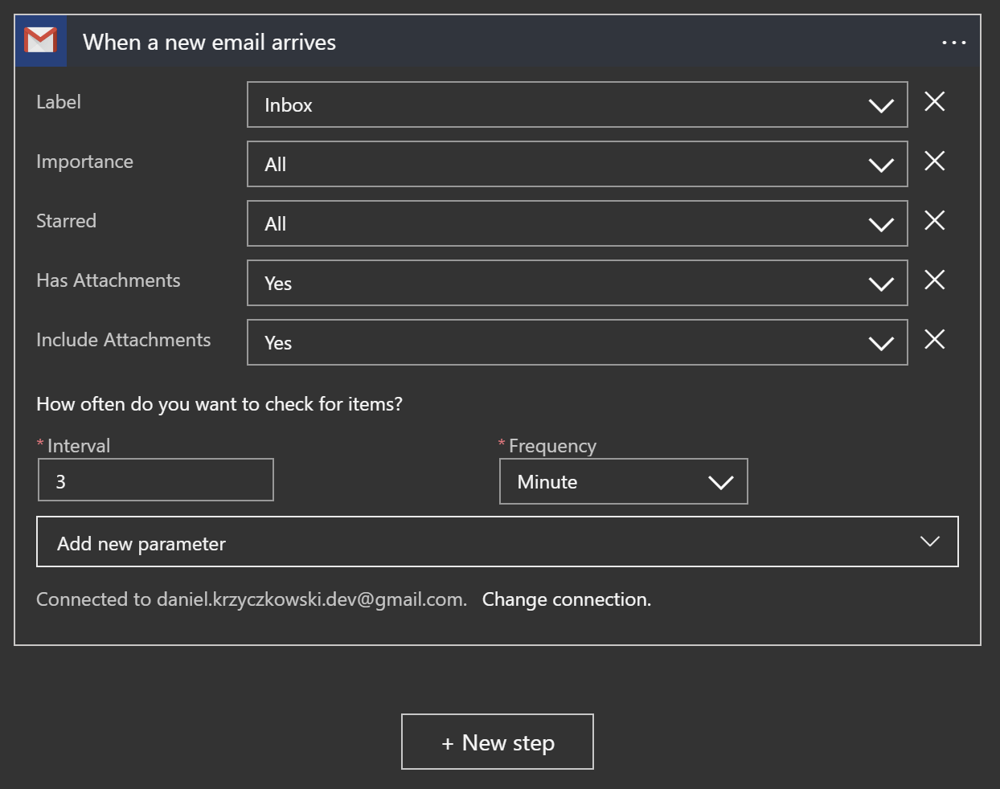

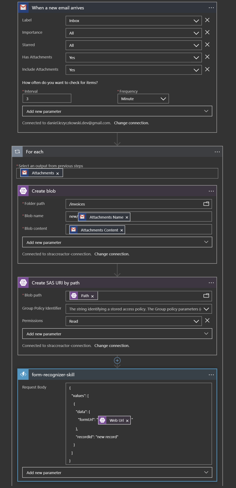

